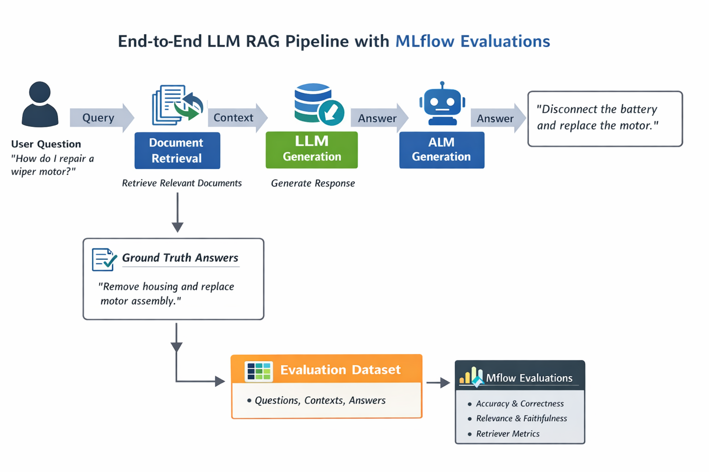

# This is part of the Databricks Generative AI certification Coursework.

Many notebooks, dashboards, and other sample code from the coursework are contained here.
The most notable coursework is the `Studebaker_RAG_LLM.ipynb` notebook where I built a sample RAG LLM API and evaluated the output of that solution using **MLFLOW Evaluations 2.x and 3.x**.  


## LLM + RAG System
This project utilizes the CD-ROM Studebaker Shop Manual data, ingests it into a databricks vector database and utilizes that vector store with a langchain LLM Chain.  

The solution utilizes ML Flow to validate some sample queries to gain some experience with MLFLow evaluations and Databricks usage of MLFlow.  

## Picture of Solution


## Sample of Q&A  

```
Question:
How do I repair the windshield wiper motor on a Studebaker truck?

Answer:
To repair the windshield wiper motor on a Studebaker truck, the type of wiper motor (electric or vacuum) needs to be identified first. 

For the electric type wiper motor:
1. Disconnect the wiper motor wires from the switch and circuit breaker.
2. Remove the main link nut (6, Fig. 35) and the main link (4) from the wiper motor.
3. Remove the four retaining bolts and remove the motor.

To disassemble the electric type wiper motor:
1. Remove the three screws holding the mounting bracket to the wiper motor and remove the bracket (refer to Fig. 35 and related text).
2. Remove the two screws from the clip holding the wiring cable to the parking switch plate (1, Fig. 36).

To reassemble the electric type wiper motor:
1. Install the armature (16, Fig. 36).
2. Install the brush springs (17) and brushes (18) in the commutator end (refer to Fig. 36 and related text).

For the vacuum type wiper motor:
1. Disconnect the wiper motor vacuum hose (3, Fig. 33).
2. Remove the clamp screw which holds the valve control cable to the motor and remove the end of the cable from the valve.
3. Remove the clips (10, Fig. 24) that retain the connecting links to the wiper drive (11).
4. Remove the two nuts and screws that hold the wiper motor and remove the motor.

Relevant figures and diagrams can be found in the provided context, specifically Fig. 33, Fig. 35, and Fig. 36. 

The part numbers for the impacted components are not directly stated in the provided context, but the following components are mentioned:
- Main link (4, Fig. 35)
- Main link nut (6, Fig. 35)
- Wiper motor (3, Fig. 33 and ******
```